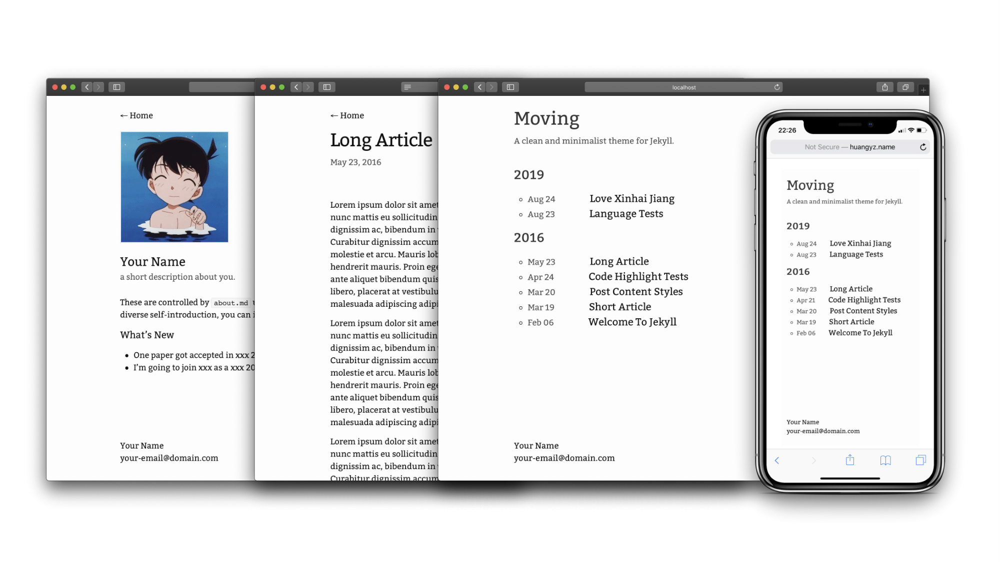

# moving

[](https://badge.fury.io/rb/moving)   

Moving is a clean and minimalist theme for [Jekyll](https://jekyllrb.com/), focusing on pure and efficient writing. [[view demo]](https://huangyz.name/moving/)




If you enjoy this theme, you can buy me a coffee : )

[](https://www.paypal.me/huangyz0918)

## Installation

### New Blog

If you you want to create a new blog using moving. You can follow these steps after setting up the [Jekyll](https://jekyllrb.com) environments:

Clone this repository:

```bash
git clone https://github.com/huangyz0918/moving.git
```

Move into that directory:

```bash
cd moving/
```

Install required gems using `bundle`:

```bash
bundle install
```

Run the blog in localhost

```bash
jekyll serve
```

Once you successfully run the moving blog, you can modify the theme and add posts by yourself, have fun!

### Add Moving to an Existing Blog

Add this line to your Jekyll site's `Gemfile`:

```ruby
gem "moving"
```

And add this line to your Jekyll site's `_config.yml`:

```yaml
theme: moving
```

And then execute:

    $ bundle

Or install it yourself as:

    $ gem install moving

### Deploy to Github Pages

:warning: If you want to publish your site in [Github Pages](https://pages.github.com/). Change `theme: xxx` in `_config.yml` to `remote_theme: huangyz0918/moving` then push to your github repo (this is important, or you will get an error from github pages that not support the moving theme). If you want to test your site locally, you can change that to `theme: moving` and build again.

Here is an [example](https://github.com/huangyz0918/personal-page-blog) for Github Pages.

## Usage

You can modify the `_config.yml` to custom your blog. An example is if you want to change the back button's text in each post, you can change the `back_to`.

```yaml
title: Moving # The title of the blog
author: Your Name # Your name
email: your-email@domain.com # your email shown in the footer
url: https://huangyz.name/moving/ # this is your site's root address.
description: > # this means to ignore newlines until "show_excerpts:"
  A clean and minimalist theme for Jekyll.
favicon: "./favicon.ico" # set the favicon of the site
show_excerpts: false # set to true to show excerpts on the homepage

# Moving date format
# refer to https://shopify.github.io/liquid/filters/date/ if you want to customize this
moving:
  avatar_url: "https://i.loli.net/2019/08/26/JzCLhDWPEybZr2T.jpg" # avatar in about page
  about_you: a short description about you. # short description about you in about page
  date_format: "%b %d" # date format of posts in home page
  back_to: "Home" # In the post page, you have a back button above the title, you can custom the text by yourself.

# Build settings
theme: moving # note, please use huangyz0918/moving if you want to publish to Github Pages.
```

## Contributing

Bug reports and pull requests are welcome on GitHub at [here](https://github.com/huangyz0918/moving). This project is intended to be a safe, welcoming space for collaboration, and contributors are expected to adhere to the [Contributor Covenant](http://contributor-covenant.org) code of conduct.

## Development

To set up your environment to develop this theme, run `bundle install`.

Your theme is setup just like a normal Jekyll site! To test your theme, run `bundle exec jekyll serve` and open your browser at `http://localhost:4000`. This starts a Jekyll server using your theme. Add pages, documents, data, etc. like normal to test your theme's contents. As you make modifications to your theme and to your content, your site will regenerate and you should see the changes in the browser after a refresh, just like normal.

When your theme is released, only the files in `_layouts`, `_includes`, `_sass` and `assets` tracked with Git will be bundled.
To add a custom directory to your theme-gem, please edit the regexp in `moving.gemspec` accordingly.

## License

The theme is available as open source under the terms of the [MIT License](https://opensource.org/licenses/MIT).
